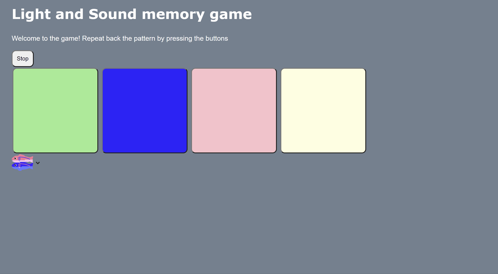

# Pre-work - *Memory Game*

**Memory Game** is a Light & Sound Memory game to apply for CodePath's SITE Program. 

Submitted by: **Ryan Cesa-Rivera**

Time spent: **2** hours spent in total

Link to project: (https://silent-muddy-fang.glitch.me)

## Required Functionality

The following **required** functionality is complete:

* [ ] Game interface has a heading (h1 tag), a line of body text (p tag), and four buttons that match the demo app
* [ ] "Start" button toggles between "Start" and "Stop" when clicked. 
* [ ] Game buttons each light up and play a sound when clicked. 
* [ ] Computer plays back sequence of clues including sound and visual cue for each button
* [ ] Play progresses to the next turn (the user gets the next step in the pattern) after a correct guess. 
* [ ] User wins the game after guessing a complete pattern
* [ ] User loses the game after an incorrect guess

- [ ] List anything else that you can get done to improve the app!

## Video Walkthrough (GIF)

If you recorded multiple GIFs for all the implemented features, you can add them here:

## Reflection Questions
1. If you used any outside resources to help complete your submission (websites, books, people, etc) list them here. 
[None other than the prework site]

2. What was a challenge you encountered in creating this submission (be specific)? How did you overcome it? (recommended 200 - 400 words) 
[One challenge I have encountered in creating this submission would be creating the buttons and having the background light up and coordinate to my javascript code. While trying to make my 4 buttons light up and coordinate with the sound, I have found it difficult to have the buttons light up when I needed them to after I pressed them. They seemed like they didn't want to glow up and it took me a while to figure out why. Along with this, organizing the functions within javascript was difficut since I wasn't able to get the order right for some of them which gave me some error. One way I overcame this challenge was through analyzing the code in chunks. I first began in debugging the codeand see where JS file was wrong. The functions in the javascript file seemed to be the sissue for me so I looked there. The 1st step I have was checking that I have inserted all the correct code that was given from the codepath prework to ensure that I have copied and pasted the correct functions with my own additional details. Finally, with these two steps involved I have figured out the steps needed to be done to fix my code, in which I have forgotten to add the turn on function for the button]

3. What questions about web development do you have after completing your submission? (recommended 100 - 300 words) 

[Something I would like to ask is to what extent can I use web development for my future? As someone who is studying cyber security it is quite important to know how to do some code in different languages so that way I can assess different vulnerabilities. Also something that I would like to know is how some services can be implemented using web development. What features do I need to put in so that way I can have a successful website for clients? Also which bots I have to include in the website. These are questions I would like answers to.]

4. If you had a few more hours to work on this project, what would you spend them doing (for example: refactoring certain functions, adding additional features, etc). Be specific. (recommended 100 - 300 words) 
[If I had some time I would have loved to really get a better grasp on the programming languages involved in this project. As someone who is relatively new to css, javascript, and html it would have been a treat to really study these languages in depth so that way I can have them under my repertoire. Alongside that I may have wanted to incorporate more buttons and a faster speed to make the game even more challenging for the user. Everyone loves a challenge and I feel like with more time I would have been able to provide that experience.]

## Interview Recording URL Link

[My 5-minute Interview Recording](https://www.loom.com/share/50f38dadd5044d6aa7bf1ddc9f4dd558)

## License

    Copyright [Ryan Cesa-Rivera]

    Licensed under the Apache License, Version 2.0 (the "License");
    you may not use this file except in compliance with the License.
    You may obtain a copy of the License at

        http://www.apache.org/licenses/LICENSE-2.0

    Unless required by applicable law or agreed to in writing, software
    distributed under the License is distributed on an "AS IS" BASIS,
    WITHOUT WARRANTIES OR CONDITIONS OF ANY KIND, either express or implied.
    See the License for the specific language governing permissions and
    limitations under the License.
